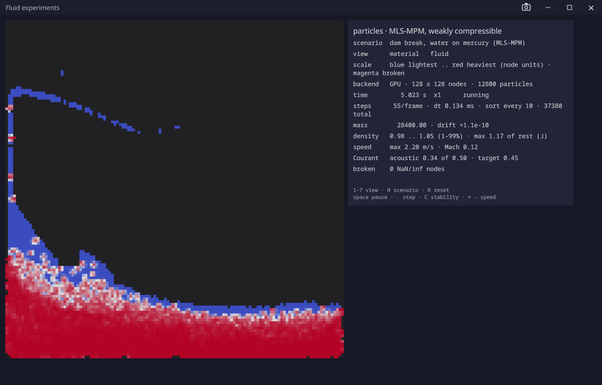

# vexelray-sim-fluid

Fluid simulation for VexelRay — **an expressive API and a high-performance simulation in the same library**,
bet on SupirVast: dynamics declared symbolically and lowered, in stages, to kernels that run on the GPU and the
CPU from one source.

It is a series of experiments rather than an implementation yet: each technique is built far enough to be
measured, and the implementation will be chosen from the results. Two scales of fluid are in view — **prop
scale** (fluid in containers) and **world scale** (fluid that is the environment) — and the work starts with
what they share. [docs/architecture.md](docs/architecture.md) is the reasoning; [docs/TODO.md](docs/TODO.md) is
what is known and not done.

It is one of several simulations. They all build on `vexelray-sim-core`, which is what they share. Rigid bodies are
`vexelray-sim-rigid`. Coupling the two, so a body floats or a wake pushes it, is `vexelray-sim-physics`, which is
also the front door for an application.



*Water on mercury (13.6 : 1) five seconds after a dam break, in the demo's material view, on the MLS-MPM particle step.*

| Module | What it holds |
| --- | --- |
| `vexelray-sim-fluid-core` | The kernels, in SupirVast IR — today a first-order shallow-water step with an adaptive time step and a budgeted integer clock, FLIP's particle-to-grid scatter in f32 and in exact fixed point with their benchmarks, a counting sort by cell, and a weakly compressible MLS-MPM particle step with two fluids of different density and surface tension — and the diagnostics that judge a state. No engine, no window. |
| `vexelray-sim-fluid-gui` | The simulation on the stack: a runner that steps a patch on resident GPU buffers, and a debug view that colours what the state holds. |
| `vexelray-sim-fluid-demo` | A framework application showing the experiments, with their readings. |

## Running

The stack's siblings must be installed to the local Maven repository first: `supirvast`, `vexelray`,
`tactroller`, `atchung`, `vexelray-gui`, `vexelray-framework`, `vexelray-sim-core`.

```bash
mvn install
```

Runs the tests that take seconds; add `-Dsupirvast.requireGpu=true` to fail rather than skip where there is no GPU.
The physics tests, which run seconds of fluid and judge what it did (a bubble rising, a drop's pressure, layers
overturning), take minutes and run only with `-Pphysics`. The sweeps and benchmarks are not assertions and run only
with `-Dflip.sweep=true`.

```bash
mvn -pl vexelray-sim-fluid-demo exec:exec
```

Opens the demo: a list of simulations on the left (the running one is filled), the picture in the middle, and on the
right a transport (reset, pause, step) and a status line above two pages.

| Page | What it holds |
| --- | --- |
| **Controls** | Every setting, each with a sentence on what it does, and only those that do something to the simulation that is running. Four groups: **Picture** (what the colours show; for 3D, a surface you drag to turn or a flat picture), **Scenario** (its physics knobs), **Speed and performance** (playback speed; for 3D the physics time a frame, particles per cell and grid size; for 2D real-time or fixed-work pacing), and **Stability** (the time step, and for 3D the step size). The live readings each control moves sit in a box beside it — keeping up, frame time, step cost beside the speed and performance controls; step safety, compression and any problems beside the time step. **Reset every setting** puts everything back. |
| **Diagnostics** | Every number the solver has, for debugging it: time, steps, mass drift, density, speed, Courant number, the latched alarms, and the keys. |

The simulations: a water dam break, oil on water, water on mercury, Rayleigh-Taylor, convection, boiling (with
no nucleation sites it bumps) and a 3D dam break. A knob that changes the state a scenario starts from restarts it
once the slider has stopped moving; every other knob reaches the running simulation.

Nothing is remembered between runs: every launch starts from the defaults, so a setting that has gone wrong is
always fixed by starting again. Only the window's placement is kept. Each setting is a flag for one launch,
`--speed=4` or `--BOILING.stones=0`; settings an older build saved in the settings file are cleared on first launch.

Keys still work: **1–8** colour view · **N** next scenario · **R** reset · **space** pause · **.** single step ·
**C** time step safe or too big · **= / −** speed · **D** the 3D water as a surface or flat, **V** a flat 3D slice or
see-through, and **B A [ ] ; ' I Z X E** for fixed-work pacing.

The debug view reserves two colours: **magenta** is a broken cell (NaN, infinity, negative depth), and
**orange to red** is a cell outside the step size the scheme is guaranteed stable for. Alarms latch, with the
simulated time they were first seen, until a reset.

### Native executable

With a GraalVM JDK (25, as `JAVA_HOME`), the demo builds to a native binary, as two editions of the same code.
Both are profile-gated, so ordinary builds stay fast:

```bash
mvn -Pnative-release -pl vexelray-sim-fluid-demo package -DskipTests
```

```bash
mvn -Pnative -pl vexelray-sim-fluid-demo package -DskipTests
```

- **release** gives `vexelray-sim-fluid-demo/target/fluid-sim.exe`: what ships, and what `installer.json` points
  at. It is a Windows GUI subsystem program, so no console window appears, and it is built without the automation
  module: `src/edition-release` is compiled instead of `src/edition-debug`, so the binary cannot open a driving
  socket (`--automation` parses and does nothing). The log is still written, to `~/.vexelray-sim-fluid-demo/logs`.
- **debug** gives `vexelray-sim-fluid-demo/target/vexelray-sim-fluid-demo.exe`: a console program with automation,
  so `--automation=0` prints the port `ottermate --launch` reads. The plain JVM build, the tests and `exec:exec` are
  this edition too.

Either is about 57 MB, built in under a minute. It is the only file: it runs from a folder holding nothing else,
and extracts nothing. It takes the same arguments as the JVM run. That depends on nothing in the stack reaching AWT, which on Windows a
native image can only ship as nine DLLs beside the executable. `vexelray-gui` keeps it so: the font atlas loads as
RGBA pixels, captures are written by its own PNG writer, and a guard test fails on any reference to AWT or ImageIO.
If the build's artifacts ever list a `.dll` again, something has started to reach AWT.

The libraries carry their own reachability metadata in their jars: the FFM build flags, every downcall shape they
declare, the window procedure, the input backend, the shaders and the font atlas. What is this demo's own (its main
class, LWJGL, SupirVast's bundled SPIR-V tools, JDK entries) is in
`vexelray-sim-fluid-demo/src/main/resources/META-INF/native-image/`. It was recorded by running the demo under the
tracing agent while `ottermate` drove every scenario, view and key, then trimmed of what the libraries list. After a
change that reaches new native or reflective code here, record it again the same way and trim it again; a gap in a
library belongs in that library's metadata. A metadata gap does not fail the build; the binary fails when it reaches
the missing call, so run it afterwards.

```bash
mvn -pl vexelray-sim-fluid-demo exec:exec -Dautomation=0 "-Dapp.jvmArgs=-agentlib:native-image-agent=config-merge-dir=$(pwd)/vexelray-sim-fluid-demo/src/main/resources/META-INF/native-image/dev.vexelray.sim/vexelray-sim-fluid-demo,config-write-period-secs=5"
```

The directory must be absolute, because `exec:exec` runs in the module's folder and a relative one lands in a new
directory beside it. `config-merge-dir` adds what the run saw to what is there, so a run need not reach everything.
The periodic write matters, because `ottermate` ends the process rather than letting it exit, and the agent
otherwise writes only at exit.

Only the GPU path has been recorded and tried. SupirVast's CPU fallback, which
lowers kernels through Truffle, cannot be forced on a machine with a GPU, so a native binary on a machine without
one is untested.

### Installer

`installer.json` describes a per-user install of the release edition through
[`vexelray-installer`](https://github.com/sibarum/vexelray-installer): `fluid-sim.exe` in
`%LOCALAPPDATA%\Programs\Fluid Sim`, with Start menu and desktop shortcuts and an Apps entry. Installing through
`irm ... | iex` rather than a browser download means the executable never carries the Mark of the Web, so
SmartScreen does not stand between a person and the first run. From a checkout of `vexelray-installer`, after
`mvn -Pnative-release -pl vexelray-sim-fluid-demo package -DskipTests` here:

```bash
java -jar installer-core/target/installer-core-0.1.0-SNAPSHOT-cli.jar --config ../vexelray-sim-fluid/installer.json --version 0.1.0 --out ../vexelray-sim-fluid --assets ../vexelray-sim-fluid/target/installer-assets
```

Upload `target/installer-assets/0.1.0/fluid-sim.exe` to the release `v0.1.0` (or add `--publish`), then commit the
generated `install.ps1`, `uninstall.ps1`, `update.ps1`, `manifest.json` and `INSTALL.md` (the generator leaves
this README alone). The one-liner is then:

```powershell
irm https://raw.githubusercontent.com/sibarum/vexelray-sim-fluid/main/install.ps1 | iex
```

### Screenshots while developing

With `-Dautomation=0` the demo opens an automation socket on a free port, and `ottermate` (in
`vexelray-gui/vexelray-gui-automation-cli`) can launch it, drive it and photograph the live window:

```bash
java -jar ../vexelray-gui/vexelray-gui-automation-cli/target/vexelray-gui-automation-cli-0.1.0-SNAPSHOT.jar --launch mvn -pl vexelray-sim-fluid-demo exec:exec -Dautomation=0
```

with commands such as `await readout.time 3.`, `key DIGIT_5`, `await readout.view |u|/c`, and
`shot screenshots/froude.png`. The readout lines are landmarks, and the view line shows its formula only once a
view change has finished fading, so a script can wait for a picture to be on screen. `screenshots/` is
gitignored.
